# Hasil Langkah langkah pratikum
## 1. Membuat dokumen HTML 
yang berupa "a" link, id "intro" (untuk css id selector) dan membuat link class button (untuk css id selector).

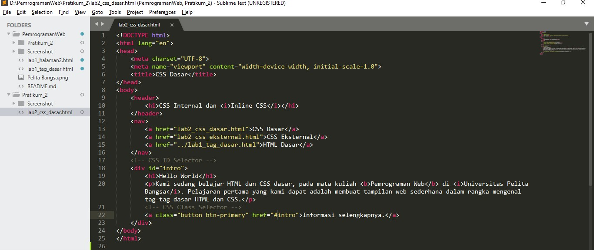

Tampilan hasilnya.

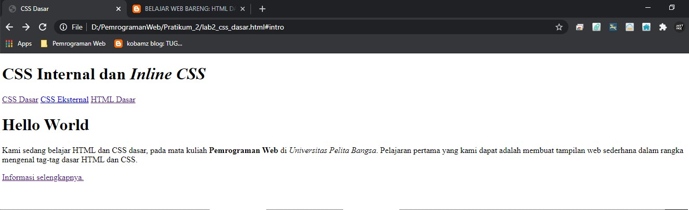

## 2. Mendeklarasikan CSS internal 
memasukan kode CSS di dalam head di bawah tittle (untuk memberikan format yang ada di dalam body, header, h1, h1 i).

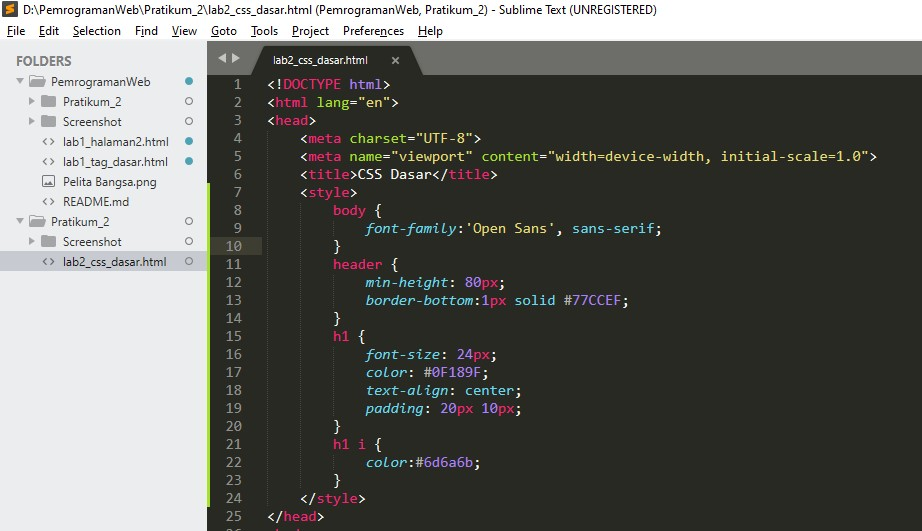

Refresh google dan lihat hasilnya.

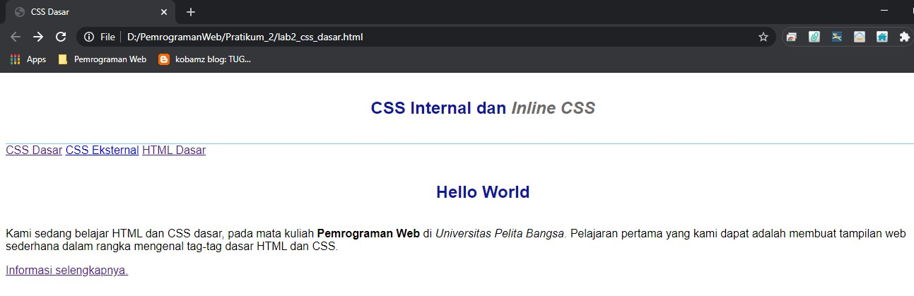

## 3. Menambah inline CSS
Memasukan deklarasi inline di dalam paragraf  tag "p".

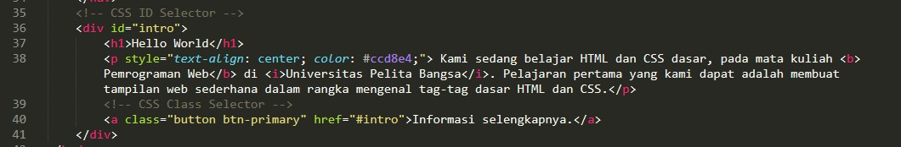

Refresh google dan lihat hasilnya.

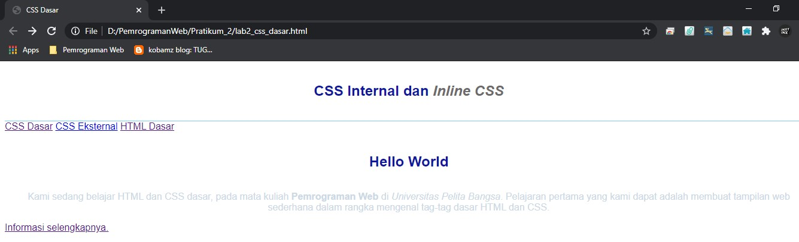

## 4. Membuat CSS eksternal
membuat file baru css style_eksternal.css dan memasukan deklarasi css.

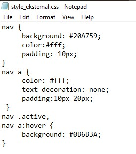

dan memasukan link ke dalam file html di dalam head untuk memanggil file css yang telah di buat.

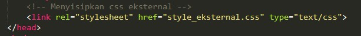

Refresh di google dan lihat hasilnya.

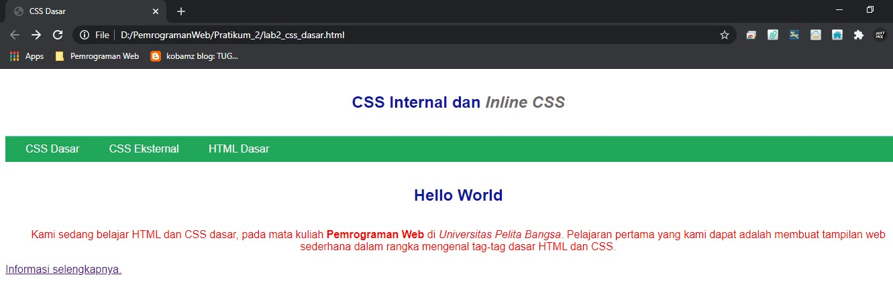

## 5. Menambahkan CSS selector
Membuat CSS selectero yang di ambil dari file html sebelumnya yang sudah di beri id.

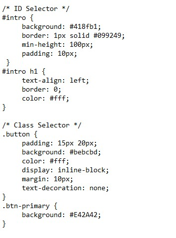

simpan dan refresh di google, lihat hasilnya.

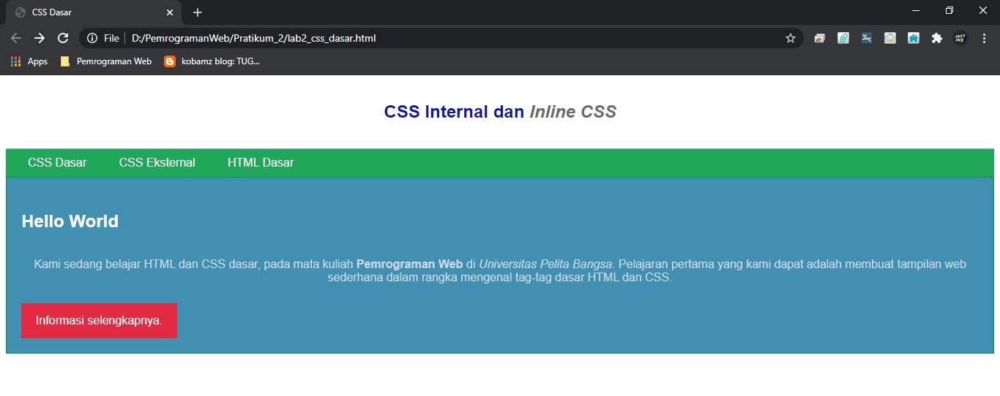

## 6. Hasil validasi CSS

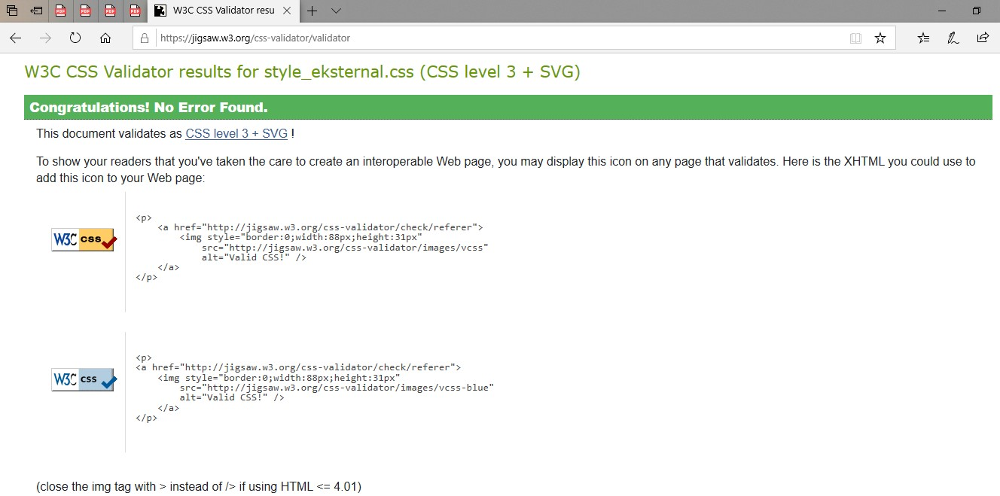

# Pertanyaan dan Tugas 
1. Lakukan eksperimen dengan mengubah dan menambah properti dan nilai pada kode CSS dengan mengacu pada CSS Cheat Sheet yang diberikan pada file terpisah dari modul ini. 2. Apa perbedaan pendeklarasian CSS elemen h1 {...} dengan #intro h1 {...}? berikan penjelasannya! 
3. Apabila ada deklarasi CSS secara internal, lalu ditambahkan CSS eksternal dan inline CSS pada elemen yang sama. Deklarasi manakah yang akan ditampilkan pada browser? Berikan penjelasan dan contohnya! 
4. Pada sebuah elemen HTML terdapat ID dan Class, apabila masing-masing selector tersebut terdapat deklarasi CSS, maka deklarasi manakah yang akan ditampilkan pada browser? Berikan penjelasan dan contohnya!(
) .

# Jawaban
#### 1. 
   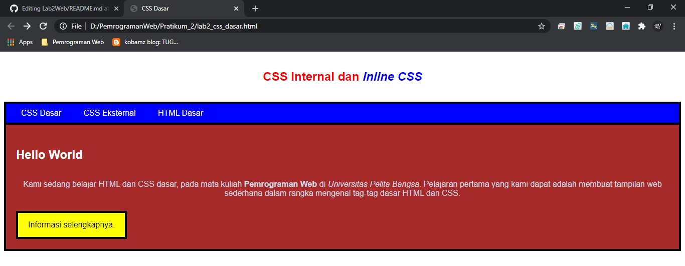

   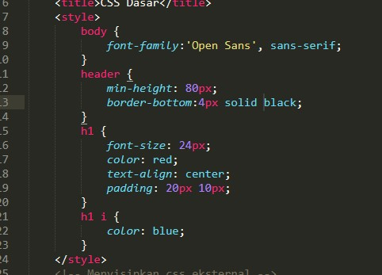
   
   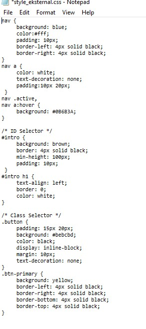

#### 2. elemen h1 biasanya ada di dalam css internal berbeda dengan #intro h1 dia menggunakan selector id didalam file html untuk di deklarasikan kedalam file css.
#### 3. Bila CSS external di dalam internal masih bisa muncul di chrome tetapi bila ada CSS selector maka div harus di dalam "body", karena fungsi CSS eksternal adalah untuk Kecepatan loading menjadi lebih cepat dan File CSS yang sama bisa digunakan di banyak halaman. pada dasarnya hasilnya sama saja.

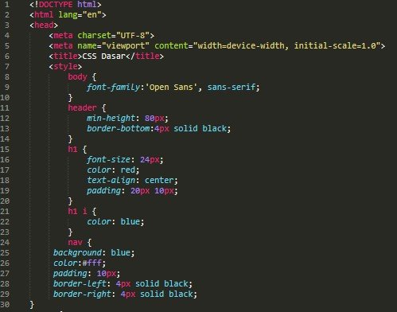
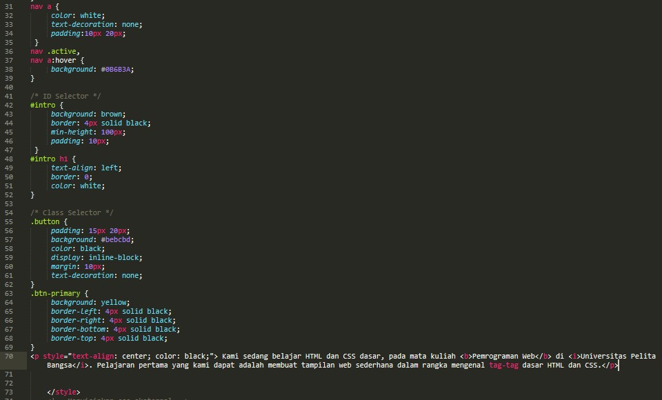
